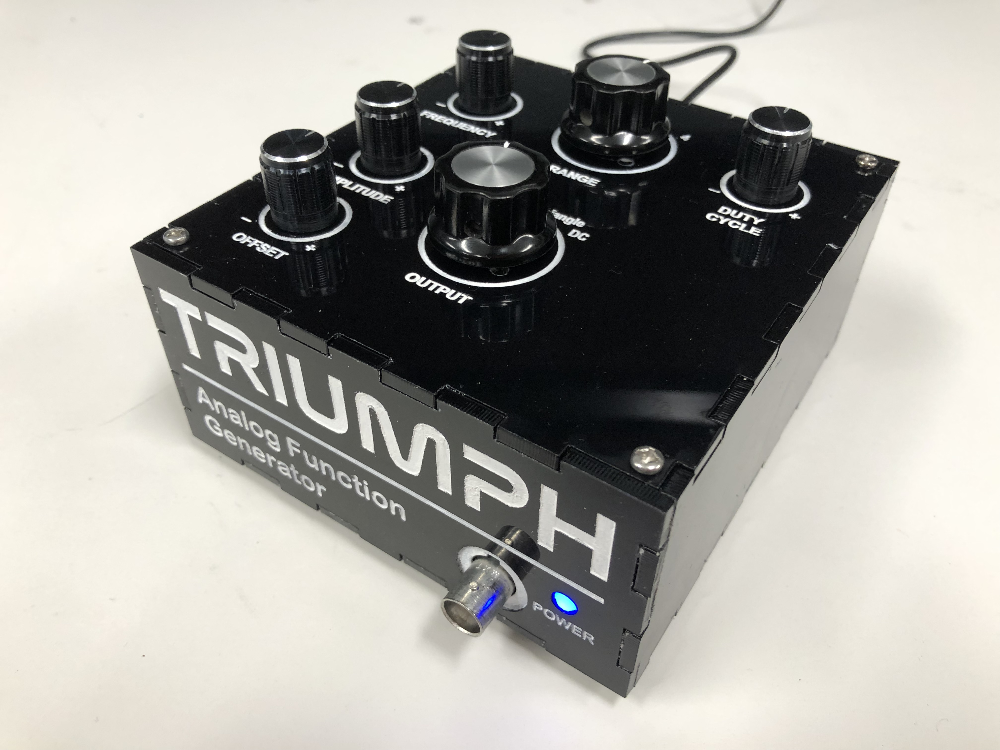
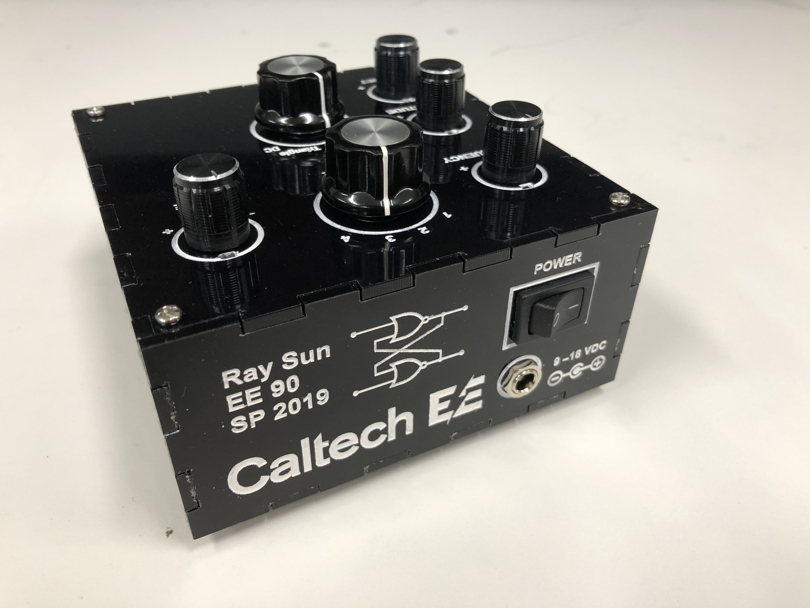
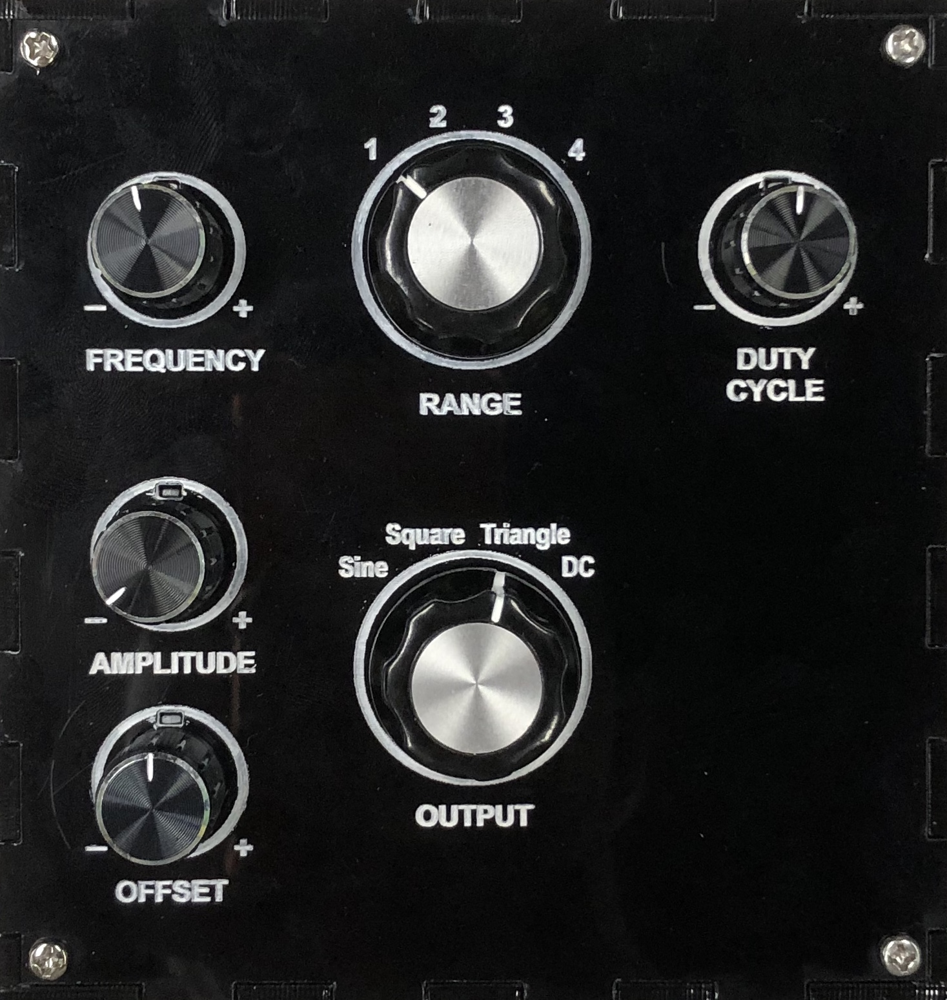
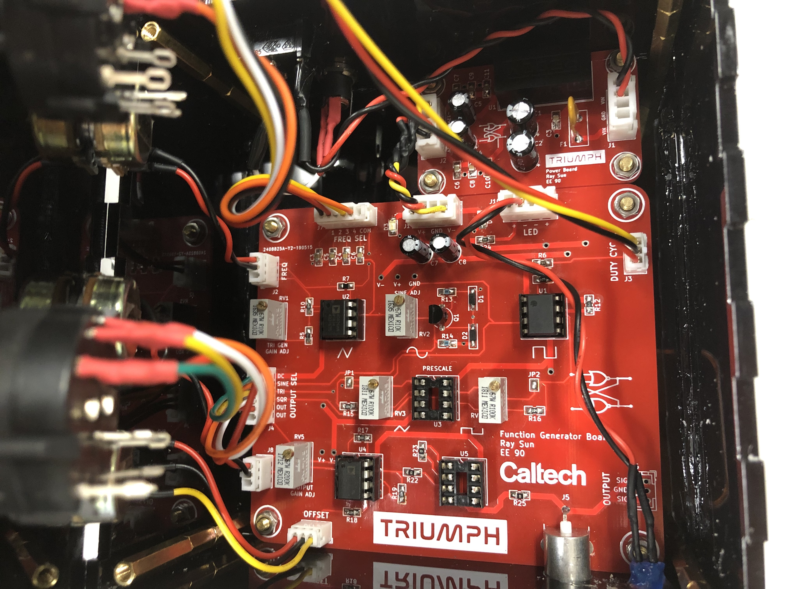

# triumph
Analog function generator project for EE 90 at Caltech

&nbsp;

&nbsp;

## Description

The Triumph Analog Function Generator is an analog function generator constructed for the Analog Electronics Project Laboratory (EE 90) capstone course at Caltech. It provides a single output channel on a 50 Ω impedance matched BNC connector. It is capable of producing sine, square, and triangle waveforms that vary in frequency over at least the range 10 Hz to 20 kHz, in addition to DC. The frequency may be adjusted through the combination of a frequency range select switch and a fine-adjustment knob on the top of the device. The output amplitude may be varied from zero up to 10 V (single-sided)  with a control knob. A second control knob allows the DC offset of the output to be varied. 

Power is supplied via 9 – 18 VDC input through a barrel jack connector on the rear of the device. A rocker switch near the power connector allows the device to be switched on and off.

A blue indicator LED on the front of the device indicates if the function generator is powered.

## Photos

## Design

An integrator with Schmitt feedback is used to generate a base triangle wave, which is passed to a Middlebrook-Richer JFET converter to create a sine wave and also a comparator to create a square wave. A positive feedback circuit associated to the comparator provides square wave duty cycle control. A final output stage provides amplitude and offset control. This general architecture achieves a good balance among simplicity, reliability, and performance.

The electronics were split among two PCBs: a main board with the function generator circuitry, and a power board that functions as a DC-DC converter supplying the former with a dual polarity power supply.

The electronics were designed with KiCad EDA v. 5.1.2. The `/triumph-main` directory contains files, documentation, and fabrication output for the main board, while the `/triumph-main-production` directory contains files reflecting post-fabrication design changes. The `/triumph-power` directory contains files for the power board.

The enclosure was designed with SolidWorks 2018, CorelDraw X7, and the [MakerCase](https://en.makercase.com/) box generator.

## Author
- Ray Sun - Undergraduate, Electrical Engineering, Caltech, Class of 2020

## Licensing
This project is released under the terms of the MIT License.
